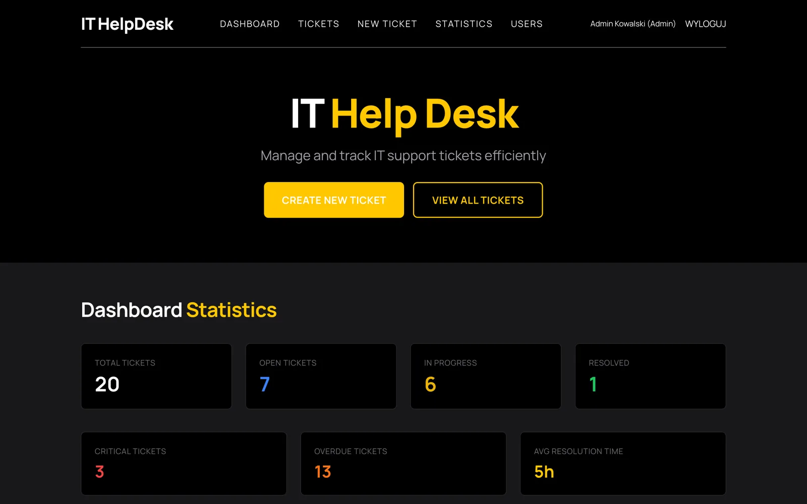
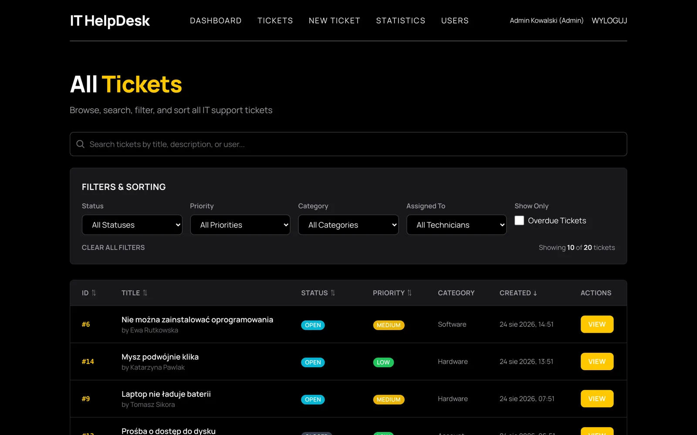
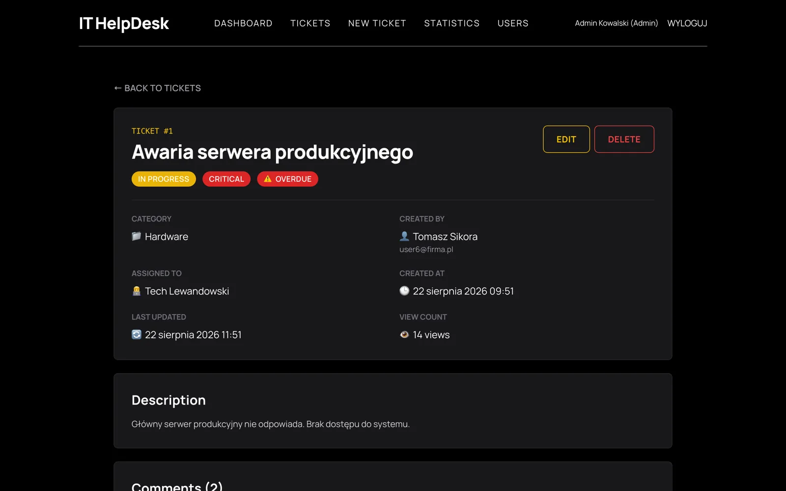
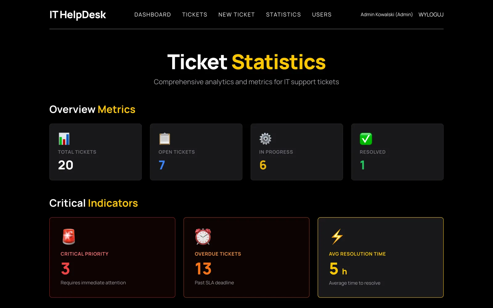
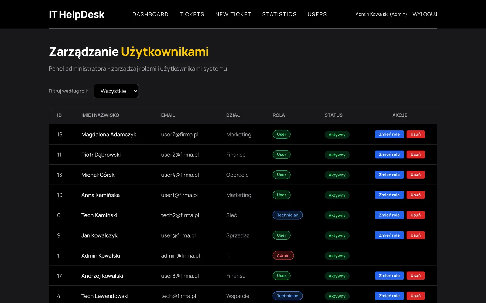
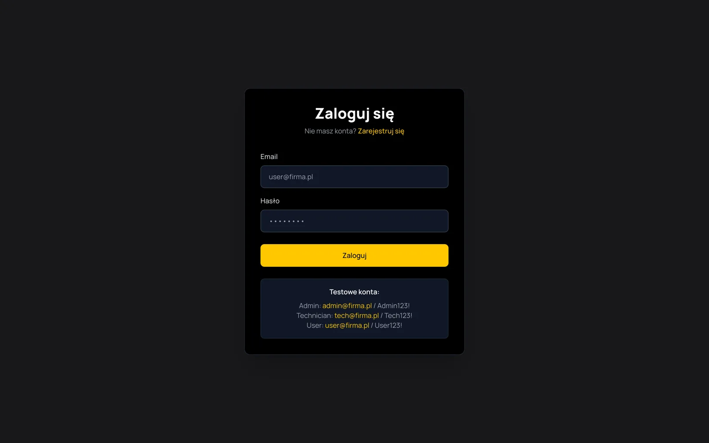
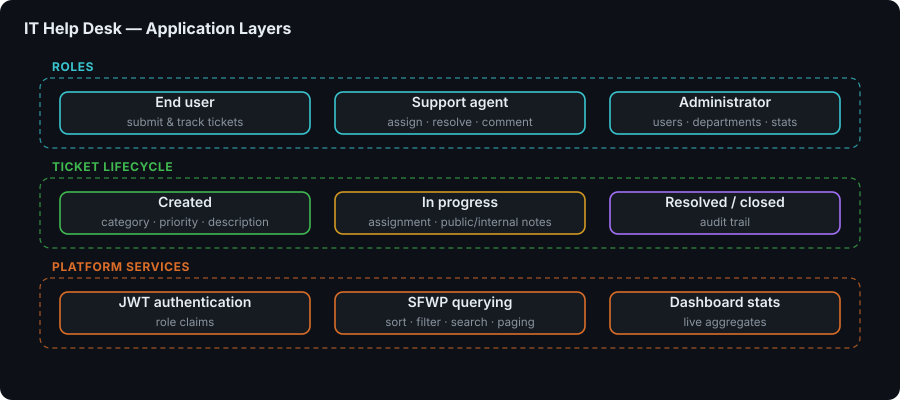
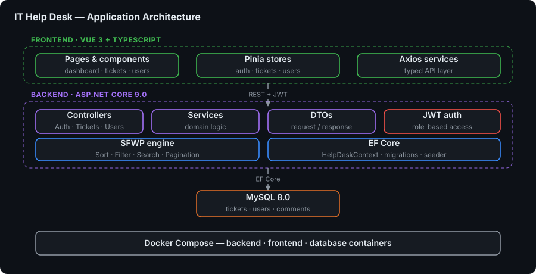

# ITHelpDeskSystem-Project-ASPNetCore-Vue

> 🚀 **Modern IT Help Desk Ticketing System** - Enterprise-grade support platform with an ASP.NET Core REST API, a Vue 3 SPA, and advanced ticket management

Welcome to the **IT Help Desk System** repository! This comprehensive ticketing solution manages technical support requests inside an organization with a modern full-stack architecture. Built with an **ASP.NET Core 9.0** REST API backend and a **Vue 3 + TypeScript** SPA frontend, the system provides efficient ticket lifecycle management, role-based access control, powerful search and filtering, and an intuitive user interface.

The platform's centrepiece is its **SFWP** (Sort, Filter, Search, Pagination) query layer, backed by JWT authentication, dashboard statistics, public and internal comments, and a responsive Tailwind UI. It is a practical reference for RESTful API design, EF Core data access, and enterprise application architecture.


📖 [Full project documentation](docs/README.md) • 🎨 [Tailwind classes guide](docs/TAILWIND_CLASSES_GUIDE.md) • 🔌 [Swagger UI](http://localhost:5000/swagger)

---

## 🎯 Key Features

### 🎫 Ticket Management

- 🔁 **Full CRUD Operations** — create, read, update and delete tickets
- 👷 **Assignment System** — assign tickets to technicians
- 📍 **Seven Ticket Statuses** — New, Open, InProgress, OnHold, Resolved, Closed, Reopened
- 🔥 **Four Priority Levels with SLA** — Low (7 days), Medium (3 days), High (24 h), Critical (4 h)
- 🗂️ **Seven Categories** — Hardware, Software, Network, Account, Email, Printer, Other
- ⏰ **Due Date Management** — with automatic overdue detection
- 👁️ **View Count Tracking** — tickets can be sorted by popularity

### 🔍 Advanced Search & Filtering (SFWP)

SFWP is the system's signature capability: every ticket listing request accepts one strongly-typed, server-validated `TicketQueryParameters` object that combines **S**orting, **F**iltering, **S**earching and **P**agination in a single query, returning a `PagedResult<TicketDto>` envelope.

- 🔎 **Full-Text Search** — across ticket title, description and user names (max 200 characters)
- 🎚️ **Multi-Criteria Filtering** — status, priority, category, assigned technician (`assignedToId`), creator (`createdById`) and overdue flag
- ↕️ **Flexible Sorting** — by `id`, `title`, `status`, `priority`, `category`, `createdAt`, `updatedAt` or `viewcount`, ascending or descending
- 📄 **Smart Pagination** — `page` (min 1) and `pageSize` (1-100, default 10), with total pages and total count returned
- 🛡️ **Validated Input** — range and regular-expression attributes reject invalid parameters with `400 Bad Request`

### 🔐 Authentication & Authorization

- 🔑 **JWT-Based Authentication** with configurable issuer, audience and expiry
- 🧑‍⚖️ **Role-Based Access Control (RBAC)**
  - **User** — creates tickets, sees only their own tickets, adds public comments
  - **Technician** — sees all tickets, updates status, adds internal notes
  - **Admin** — full access, user management, role changes, ticket deletion
- 📝 **Public Registration** — new accounts get the User role by default
- 🔒 **Secure Password Hashing** with BCrypt

### 👥 User Management

- 👤 **User Profiles** with department assignment
- 🛠️ **Admin Panel** for creating, editing and deleting users
- 🔄 **Role Management** — change user roles (Admin only)
- 📇 **Technician Directory** — dedicated endpoint for assignment dropdowns

### 💬 Comment System

- 🌐 **Public Comments** — visible to everyone involved in the ticket
- 🔏 **Internal Notes** — restricted to Technicians and Admins
- 🕰️ **Chronological Timeline** of all interactions on a ticket

### 📊 Dashboard & Statistics

- 📈 **Key Metrics** — total tickets plus open, in-progress, resolved and closed counts
- 🥧 **Distribution Views** — tickets broken down by priority and category
- ⚡ **Live Updates** — statistics served from a dedicated `/api/tickets/statistics` endpoint

### 🎨 Modern User Interface & Tooling

- 📱 **Responsive Design** with TailwindCSS, mobile-first
- 🧭 **Intuitive Navigation** with Vue Router and a Pinia-backed auth store
- ⚡ **Hot Module Replacement** via Vite for instant frontend feedback
- 📚 **Swagger / OpenAPI** with enum schema filters and rich annotations
- ❤️ **Health Endpoint** — `/api/health` for container health checks

---

## 🖼️ Screenshots

| Dashboard — live statistics | All tickets — SFWP in action |
|---|---|
| [](docs/screenshots/dashboard.webp) | [](docs/screenshots/tickets.webp) |

| Ticket detail — comments & history | Statistics |
|---|---|
| [](docs/screenshots/ticket-detail.webp) | [](docs/screenshots/statistics.webp) |

| User management | Sign in |
|---|---|
| [](docs/screenshots/users.webp) | [](docs/screenshots/login.webp) |

> Captured from the running Docker stack with the bundled seed data (20 tickets across the full status and priority range, plus admin, technician and user accounts).

---

## 🏗️ Architecture

### Application Layer



### Application Architecture



---

## 🧩 Modules / Services

| Service | Description | Stack |
|---|---|---|
| `ithelpdesk-frontend` | Vue 3 SPA built with Vite and served by Nginx | Vue 3, TypeScript, Pinia, Tailwind CSS, Nginx |
| `ithelpdesk-backend` | REST API, JWT auth, SFWP query layer, statistics, Swagger | ASP.NET Core 9.0, EF Core 8, Pomelo MySQL |
| `ithelpdesk-mysql` | Relational store, health-checked before the backend starts | MySQL 8.0 |

---

## 🛠️ Technology Stack

### Frontend

- **Vue 3.3** — progressive JavaScript framework with the composition API
- **TypeScript 5** — type-safe application code
- **Pinia 2** — state management (auth, tickets, users stores)
- **Vue Router 4** — client-side routing
- **Axios** — HTTP client with a shared API instance
- **@unhead/vue** — document head and metadata management
- **TailwindCSS 3** + **PostCSS** + **Autoprefixer** — utility-first styling
- **Vite 4** + **vue-tsc** — build tooling and type-checked builds

### Backend

- **ASP.NET Core 9.0** — modern web framework
- **Entity Framework Core 8.0** — ORM for database access
- **Pomelo.EntityFrameworkCore.MySql 8** — MySQL provider
- **Microsoft.AspNetCore.Authentication.JwtBearer 9** — JWT bearer authentication
- **BCrypt.Net-Next** — password hashing
- **Swashbuckle.AspNetCore 7** (+ Annotations) — Swagger / OpenAPI documentation

### Infrastructure

- **MySQL 8.0** — relational database with a Docker healthcheck
- **Docker** & **Docker Compose** — full-stack orchestration
- **Nginx** — static asset serving for the SPA
- **EF Core Migrations** — schema versioning, applied automatically in the container entrypoint

---

## 🚀 Getting Started

### Prerequisites

- **.NET SDK** 9.0 or higher
- **Node.js** 18+ (20+ recommended) and **npm** 9+
- **MySQL** 8.0 or higher
- **Git**

Or, for the Docker path: **Docker 20.10+** and **Docker Compose 2.0+**.

Platform installation:

```bash
# macOS (Homebrew)
brew install --cask dotnet-sdk
brew install node mysql

# Linux (Ubuntu/Debian)
wget https://packages.microsoft.com/config/ubuntu/$(lsb_release -rs)/packages-microsoft-prod.deb
sudo dpkg -i packages-microsoft-prod.deb
sudo apt-get update
sudo apt-get install -y dotnet-sdk-9.0 nodejs mysql-server
```

On Windows, install the [.NET SDK](https://dotnet.microsoft.com/download), [Node.js](https://nodejs.org/) and [MySQL](https://dev.mysql.com/downloads/installer/) from their official installers.

### 1. Clone the Repository

```bash
git clone https://github.com/dawidolko/ITHelpDeskSystem-Project-ASPNetCore-Vue.git
cd ITHelpDeskSystem-Project-ASPNetCore-Vue
```

### 2. Install Dependencies

```bash
# Backend
cd backend
dotnet tool install --global dotnet-ef
dotnet restore

# Frontend
cd ../frontend
npm install
```

### 3. Run

#### 🐳 Docker Deployment (Recommended)

The easiest way to run the entire stack — database, backend and frontend — is Docker Compose:

```bash
cd .tools/docker
docker compose up -d
```

**Access the application:**

- **Frontend** — [http://localhost:8080](http://localhost:8080)
- **Backend API** — [http://localhost:5001](http://localhost:5001)
- **Swagger UI** — [http://localhost:5001/swagger](http://localhost:5001/swagger)

Docker gives you a one-command setup with no manual installation, an isolated environment, automatic database migrations on backend startup, pre-configured service networking, health checks on all three services, and easy cleanup and restart. Ports and credentials are overridable through environment variables (`FRONTEND_PORT`, `BACKEND_PORT`, `MYSQL_PORT`, `MYSQL_DATABASE`, `MYSQL_USER`, `MYSQL_PASSWORD`, `JWT_KEY`, `JWT_ISSUER`, `JWT_AUDIENCE`, `VITE_API_URL`).

**📚 Full Docker documentation and troubleshooting guide:** [.tools/docker/README.md](.tools/docker/README.md)

#### 🖥️ Local Development

Startup scripts are provided for both halves of the stack:

```bash
# Backend — Linux/macOS
cd backend && ./start.sh
# Backend — Windows
cd backend && start.bat

# Frontend — Linux/macOS
cd frontend && ./start.sh
# Frontend — Windows
cd frontend && start.bat
```

Or run them manually:

```bash
# Terminal 1 — Backend
cd backend
dotnet ef database update
dotnet run          # or: dotnet watch run

# Terminal 2 — Frontend
cd frontend
npm run dev
```

**Access URLs:**

- **Frontend (SPA)** — [http://localhost:5173](http://localhost:5173)
- **Backend API** — [http://localhost:5000](http://localhost:5000)
- **Swagger UI** — [http://localhost:5000/swagger](http://localhost:5000/swagger)

---

## 🔧 Configuration

### 1. Database Setup

```sql
CREATE DATABASE helpdesk_db CHARACTER SET utf8mb4 COLLATE utf8mb4_unicode_ci;
CREATE USER 'helpdesk_user'@'localhost' IDENTIFIED BY 'HelpDesk2024!';
GRANT ALL PRIVILEGES ON helpdesk_db.* TO 'helpdesk_user'@'localhost';
FLUSH PRIVILEGES;
```

### 2. Backend Configuration

Edit `backend/appsettings.json`:

```json
{
  "ConnectionStrings": {
    "DefaultConnection": "Server=localhost;Database=helpdesk_db;User=helpdesk_user;Password=HelpDesk2024!;Port=3306;"
  },
  "Jwt": {
    "Key": "your-secret-key-min-32-characters",
    "Issuer": "HelpDeskAPI",
    "Audience": "HelpDeskClient",
    "ExpiryMinutes": 60
  }
}
```

### 3. Frontend Configuration

Create or edit `frontend/.env`:

```env
VITE_API_URL=http://localhost:5000/api
```

### 4. CORS Configuration (Optional)

Add extra origins in `backend/Program.cs` if you serve the SPA from another port:

```csharp
policy.WithOrigins(
    "http://localhost:5173",
    "http://localhost:5174",
    "http://localhost:8080"
);
```

---

## 💻 Development

### Backend Commands

```bash
cd backend

dotnet watch run                                  # run with hot reload

dotnet ef migrations add <MigrationName>          # Entity Framework migrations
dotnet ef database update
dotnet ef migrations remove
dotnet ef migrations script

dotnet build --configuration Release              # build for production
dotnet publish --configuration Release
```

### Frontend Commands

```bash
cd frontend

npm run dev       # development server with HMR
npm run build     # type-check (vue-tsc) and build for production
npm run preview   # preview the production build
```

### API Testing Examples

The repository ships a ready-to-use request collection at `backend/api-test.http`. With curl:

```bash
# Get tickets with SFWP parameters
curl "http://localhost:5000/api/tickets?status=Open&priority=High&sortBy=createdAt&sortOrder=desc&page=1&pageSize=10"

# Login
curl -X POST http://localhost:5000/api/auth/login \
  -H "Content-Type: application/json" \
  -d '{"email":"admin@firma.pl","password":"Admin123!"}'
```

---

## 🔌 API Overview

### Authentication Endpoints (Public)

| Method | Endpoint | Description |
|---|---|---|
| POST | `/api/auth/register` | Register a new user (User role by default) |
| POST | `/api/auth/login` | Login and receive a JWT token |

### Ticket Endpoints (Requires Auth)

| Method | Endpoint | Auth | Description |
|---|---|---|---|
| GET | `/api/tickets` | Any | List tickets with full SFWP support |
| GET | `/api/tickets/{id}` | Any | Get ticket details |
| POST | `/api/tickets` | Any | Create a new ticket |
| PUT | `/api/tickets/{id}` | Any | Update a ticket |
| DELETE | `/api/tickets/{id}` | Admin | Delete a ticket |
| POST | `/api/tickets/{id}/comments` | Any | Add a comment to a ticket |
| GET | `/api/tickets/statistics` | Any | Dashboard statistics |

### User Endpoints (Requires Auth)

| Method | Endpoint | Auth | Description |
|---|---|---|---|
| GET | `/api/users` | Admin / Technician | List users |
| GET | `/api/users/technicians` | Any | Get the technician list |
| GET | `/api/users/{id}` | Any | Get user details |
| POST | `/api/users` | Admin | Create a user |
| PUT | `/api/users/{id}` | Admin | Update a user |
| PUT | `/api/users/{id}/role` | Admin | Change a user's role |
| DELETE | `/api/users/{id}` | Admin | Delete a user |

### Utility

| Method | Endpoint | Description |
|---|---|---|
| GET | `/api/health` | Health check used by the Docker healthcheck |

### SFWP Query Parameters

| Parameter | Values | Default |
|---|---|---|
| `page` | integer ≥ 1 | `1` |
| `pageSize` | 1-100 | `10` |
| `search` | free text, max 200 chars (title, description, user names) | — |
| `status` | New, Open, InProgress, OnHold, Resolved, Closed, Reopened | — |
| `priority` | Low, Medium, High, Critical | — |
| `category` | Hardware, Software, Network, Account, Email, Printer, Other | — |
| `assignedToId` | user id | — |
| `createdById` | user id | — |
| `isOverdue` | `true` / `false` | — |
| `sortBy` | id, title, status, priority, category, createdAt, updatedAt, viewcount | `CreatedAt` |
| `sortOrder` | asc, desc | `desc` |

---

## 📊 Sample Data

`DbSeeder` populates the database on first startup:

### Demo Users (18 total)

| Email | Password | Role | Description |
|---|---|---|---|
| admin@firma.pl | Admin123! | Admin | Primary administrator |
| admin1@firma.pl | Admin123! | Admin | Secondary administrator |
| tech@firma.pl | Tech123! | Technician | Lead technician |
| tech1@firma.pl | Tech123! | Technician | Support technician |
| user@firma.pl | User123! | User | Regular user |
| user1@firma.pl | User123! | User | Test user |

_Additional accounts are also seeded: `admin2@firma.pl`, `tech2@firma.pl`-`tech4@firma.pl` and `user2@firma.pl`-`user9@firma.pl` (3 Admins, 5 Technicians, 10 Users in total)._

### Sample Tickets (20 total)

- Varied statuses, priorities and categories across the full enum ranges
- Realistic Polish-language titles and descriptions
- Some tickets carry due dates and land in an overdue state
- Randomly assigned to seeded technicians and created by seeded users

### Sample Comments

- Generated across the first 15 tickets, mixing public comments and internal notes
- Chronologically ordered to demonstrate the ticket timeline

---

## 📁 Project Structure

```
ITHelpDeskSystem-Project-ASPNetCore-Vue/
├── 📁 backend/                          # ASP.NET Core 9.0 REST API
│   ├── 📁 Controllers/
│   │   ├── 🔐 AuthController.cs         # Register / login
│   │   ├── 🎫 TicketsController.cs      # Tickets, comments, statistics
│   │   └── 👥 UsersController.cs        # User & role management
│   ├── 📁 Data/
│   │   ├── 🗄️ HelpDeskContext.cs        # EF Core DbContext
│   │   └── 🌱 DbSeeder.cs               # Database seeding
│   ├── 📁 DTOs/
│   │   ├── AuthDtos.cs                  # Auth request/response payloads
│   │   └── TicketDtos.cs                # Ticket, SFWP query & stats DTOs
│   ├── 📁 Models/
│   │   ├── 🎫 Ticket.cs                 # Ticket entity
│   │   ├── 👤 User.cs                   # User entity
│   │   ├── 💬 Comment.cs                # Comment entity
│   │   └── 📋 Enums.cs                  # Status, Priority, Category enums
│   ├── 📁 Migrations/                   # EF Core migrations
│   ├── 📁 Swagger/
│   │   └── EnumSchemaFilter.cs          # Readable enums in OpenAPI
│   ├── 🚀 Program.cs                    # Entry point, DI, auth, Swagger, health
│   ├── ⚙️ appsettings.json              # Connection string & JWT settings
│   ├── 🧪 api-test.http                 # Ready-made API requests
│   ├── 📦 HelpDeskAPI.csproj            # Project & NuGet references
│   ├── 🔧 start.sh                      # Linux/macOS startup script
│   └── 🔧 start.bat                     # Windows startup script
├── 📁 frontend/                         # Vue 3 + TypeScript SPA
│   ├── 📁 public/icons/                 # Static icons
│   ├── 📁 src/
│   │   ├── 📁 components/
│   │   │   ├── Pagination.vue
│   │   │   ├── SearchInput.vue
│   │   │   ├── StatusBadge.vue
│   │   │   ├── navigation-global.vue
│   │   │   └── footer-global.vue
│   │   ├── 📁 pages/
│   │   │   ├── Dashboard/dashboard-page.vue
│   │   │   ├── Tickets/tickets-page.vue
│   │   │   ├── Tickets/create-ticket-page.vue
│   │   │   ├── Tickets/ticket-detail-page.vue
│   │   │   ├── Statistics/statistics-page.vue
│   │   │   ├── Users/UsersManagementPage.vue
│   │   │   ├── Login/LoginPage.vue
│   │   │   ├── Register/RegisterPage.vue
│   │   │   └── 404/404-page.vue
│   │   ├── 📁 routes/routes.ts          # Vue Router configuration
│   │   ├── 📁 services/                 # api.ts, ticketService.ts, userService.ts
│   │   ├── 📁 stores/                   # Pinia: authStore, ticketStore, userStore
│   │   ├── 📁 types/ticket.types.ts     # Shared TypeScript interfaces
│   │   ├── 💻 App.vue                   # Root component
│   │   ├── 🚀 main.ts                   # Vue entry point
│   │   └── 🎨 style.css                 # Tailwind entry stylesheet
│   ├── 📦 package.json                  # Node.js dependencies & scripts
│   ├── ⚙️ vite.config.ts                # Vite configuration
│   ├── 🎨 tailwind.config.js            # Tailwind CSS config
│   ├── 📝 tsconfig.json                 # TypeScript config
│   ├── 🔧 start.sh                      # Linux/macOS startup script
│   └── 🔧 start.bat                     # Windows startup script
├── 📁 docs/                             # Project documentation
│   ├── 📖 README.md                     # Detailed technical documentation
│   ├── 🎨 TAILWIND_CLASSES_GUIDE.md     # Styling conventions
│   ├── 📄 AI2 OE dokumentacja projektu.pdf / .docx
│   └── 📁 diagrams/                     # Architecture diagrams (SVG)
├── 📁 .tools/docker/                    # Docker deployment
│   ├── 🐳 docker-compose.yml            # Service orchestration
│   ├── 📋 Dockerfile.backend            # Backend container
│   ├── 📋 Dockerfile.frontend           # Frontend container
│   ├── 🔧 docker-entrypoint-backend.sh  # Applies migrations, then starts the API
│   ├── ⚙️ nginx.conf                    # Nginx config for the SPA
│   ├── 🔧 start.sh / start.bat          # Docker helper scripts
│   └── 📖 README.md                     # Docker documentation
└── 📖 README.md                         # Project documentation
```

---

## 🧰 Troubleshooting

### Backend Issues

**MySQL connection failed:**

```bash
# macOS
brew services list && brew services start mysql

# Linux
sudo systemctl status mysql && sudo systemctl start mysql

# Test the connection
mysql -u helpdesk_user -p -h localhost
```

**Entity Framework issues:**

```bash
dotnet tool install --global dotnet-ef   # install EF tools
dotnet ef --version                      # check version

dotnet ef database drop                  # reset the database
dotnet ef database update
```

### Frontend Issues

**CORS errors** — verify the backend CORS policy allows the frontend origin, check the actual origin in DevTools, then hard-refresh (Cmd+Shift+R / Ctrl+Shift+R).

**API connection failed** — confirm `frontend/.env` has the correct `VITE_API_URL`, that the backend is up (`curl http://localhost:5000/api/health`), and that both servers use `http://` in development.

**TypeScript errors:**

```bash
rm -rf node_modules package-lock.json
npm cache clean --force
npm install
npx vue-tsc --noEmit
```

### Database Issues

**Empty database** — seeding runs from `Program.cs` via `DbSeeder.Initialize`; if it did not run, drop and recreate:

```bash
dotnet ef database drop --force
dotnet ef database update
```

**Migration conflicts:**

```bash
dotnet ef migrations remove
dotnet ef migrations add InitialCreate
dotnet ef database update
```

---

## 🤝 Contributing

Contributions are highly welcomed! Here's how you can help:

- 🐛 **Report bugs** — found an issue? Let us know!
- 💡 **Suggest improvements** — have ideas for better features?
- 🔧 **Submit pull requests** — share your enhancements and solutions
- 📖 **Improve documentation** — help make the project clearer

Feel free to open issues or reach out through GitHub for any questions or suggestions.

---

## 📄 License

This project is open source and available under the [MIT License](LICENSE).

---

## 👨‍💻 Author

Created by **[Dawid Olko](https://github.com/dawidolko)**

- **Website** — [dawidolko.pl](https://dawidolko.pl/)
- **LinkedIn** — [@dawidolko](https://www.linkedin.com/in/dawidolko/)
